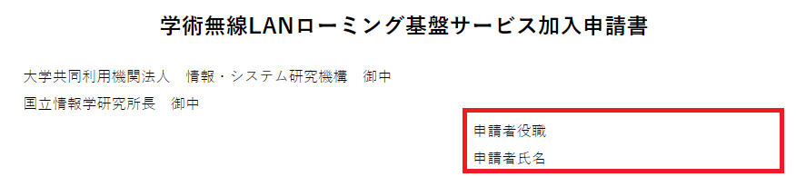
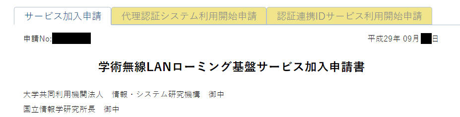
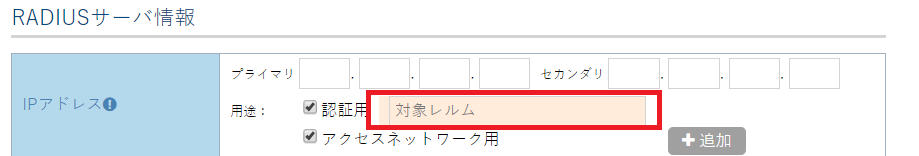

# 申請のポイント

eduroam JP申請システムからの申請のポイントをまとめます。\
以下を参考に、申請書を作成してください。

### 1．申請者役職・氏名について

申請者の役職・氏名については、学術無線LANローミング基盤サービス加入規程第4条2項にあるとおり、**機関の長の役職とお名前**が必要です。\
**学長や理事長など、機関の代表者となる方の役職・氏名**をご記入ください。



### 2．ネットワーク収容形態

eduroam用アクセスネットワークの状況に応じて、該当するものをすべて選択してください。

**自機関が所有するIPアドレスブロックを利用する場合**

eduroam用に切り出したネットワークアドレスを記載してください。

例）150.100.23.0/23

**SINETからeduroam接続用IPアドレスの割り当てを受ける場合**

**　　**自機関のIPアドレスに余裕がない場合などは、SINETからIPアドレスを割り当てます。\
　　NATでeduroam利用者にはプライベートIPアドレスを割り当ててご利用ください。\
　　**割り当てられたアドレスの利用方法は文書「[SINETにおけるeduroamアクセスネットワークの収容について](https://www.eduroam.jp/https://eduroam.jp/document/504)」をご参照ください。**

　　新規加入申請の場合、または新たに割り当てを申請する場合は、チェックだけしてください。\
　　こちらで割り当てて記入します。申請の承認後、確認してください。

　　加入済み機関で、すでに割り当て済みの場合は、チェックと共に割り当てられたネットワークアドレスを記入してください。\
***　　※基本は/30で割り当てますが、より広いレンジで割り当てることも可能です。\
　　　複数のキャンパスそれぞれで接続用のIPアドレスが必要な場合などはご相談ください。\
　  ※このアドレスの利用にはSINETへの申請が必要です。申請承認のコメントに手順等を記載してお知らせします。***

**　新たに回線を用意する場合**\
　　新たに契約した回線のネットワークアドレスをご記入ください。

**　eduroam対応事業者によるマネージドサービスを利用する場合**\
　　チェックのみ行い、備考欄に事業者名を記入してください。\
　　例）NHNテコラスなど

### 3．認証システムの選択

認証システムについては、利用するすべてを選択してください。

　**自機関でRADIUS認証サーバを運用する場合**\
　　レルム(機関のドメイン)を記入してください。\
　　　例) ```nii.ac.jp```

　　※ドメインの前にサブレルムを付けて申請されることが多々見受けられますが、サブレルムを排除したドメインのみを記入してください。\
　　　eduroam JPでは、末尾がドメインと一致するレルムをすべて対象機関のRADIUSサーバに転送します。サブレルムを付加しての運用については\
　　　ご自由にしていただいて構いませんが、サブレルムによる振り分け等は加入機関側で行い、機関内の処理で完結するようにしてください。

　**認証連携IDサービスを利用する場合**\
　　機関のドメインを記入してください。\
　　　例）```nii.ac.jp``` \
　　チェックを入れると**認証連携IDサービス利用申請タブ**が増えるので、必要事項を記入してください。\
　　学認参加IdPに接続設定を行い、一度アクセスしておくとスムーズに進みます。



　**代理認証システムを利用する場合**\
　　機関のドメインを記入してください。\
　　　例）```nii.ac.jp``` \
　　チェックを入れると**代理認証システム利用申請タブ**が増えるので、必要事項を記入してください。\
　　申請の承認時に通知されるURLからサインアップしてください。

***注意：***\
自機関の認証サーバを運用する場合、認証連携IDサービス、代理認証サービスを利用する場合のいずれにおいても、特別な事情がない限り、サブレルムを含まない、機関の保有するドメインを記入してください。\
特に自前の認証用サーバを運用する場合、eduroam JPではサブレルムを付加して運用することは許容しますが、JP RADIUS Proxyサーバでは末尾が機関の保有するドメインであるものは、どんなサブレルムが付加されていてもすべて加入機関のRADIUS認証用サーバに転送します。\
サブレルムごとになんらかの振り分けが必要な場合は機関内のシステムで完結させるようにしてください。

　

　**事業者の認証サービスを利用する場合**\
　　自機関でRADIUS認証用サーバを運用するにチェックし、すぐ横の備考欄に事業者名を記入する。\
　　RADIUSサーバ情報に**ダミーのIPアドレスと共通鍵2を記入し、「認証用」にチェック**する。

　　　例）IP「0.0.0.0」、「認証用」にチェック、共通鍵2「dummy」など\
\
　　※アクセスネットワーク用のRADIUS Proxyサーバを運用する場合はRADIUSサーバ情報のIPアドレス入力欄の「追加」ボタンで\
　　　入力欄を増やして記入する。

　　　ダミーのセカンダリに記入しないように注意すること。

### 4．RADIUSサーバ情報

ネットワーク収容形態と認証システムの組み合わせで必要な記入項目が違うので、以下のセットと表で確認してください。

※RADIUS認証用サーバとRADIUS Proxyサーバが分離している場合は、IPアドレス入力欄の「追加」ボタンを押して入力欄を増やし、どちらかに認証用サーバのIPアドレス入力と「認証用」のチェック、もう一方にProxyサーバのIPアドレス入力と「アクセスネットワーク用」のチェックをしてください。

#### Aセット

RADIUS認証サーバIPアドレス+「認証用」チェック+共通鍵2+テストアカウント

#### Bセット

RADIUS ProxyサーバIPアドレス+「アクセスネットワーク用」チェック+共通鍵1

#### Cセット

Dummy IPアドレス+「認証用」チェック+共通鍵2「dummy(なんでもいい)」

<table>
<colgroup>
<col style="width: 19%" />
<col style="width: 20%" />
<col style="width: 16%" />
<col style="width: 21%" />
<col style="width: 22%" />
</colgroup>
<thead>
<tr>
<th></th>
<th style="text-align: center;"><strong>自機関の所有する</strong><br />
<strong>ネットワークアドレスを使用する</strong></th>
<th style="text-align: center;"><strong>新たに回線を用意する</strong></th>
<th style="text-align: center;"><strong>SINETからeduroam接続用</strong><br />
<strong>IPアドレスの割当を受ける</strong></th>
<th style="text-align: center;"><strong>eduroam対応事業者による</strong><br />
<strong>マネージドサービスを利用する</strong></th>
</tr>
</thead>
<tbody>
<tr>
<td><strong>RADIUS認証サーバ運用</strong></td>
<td style="text-align: center;">A+B</td>
<td style="text-align: center;">A+B</td>
<td style="text-align: center;">A+B</td>
<td style="text-align: center;">Aのみ</td>
</tr>
<tr>
<td><strong>代理認証システム</strong></td>
<td style="text-align: center;">Bのみ</td>
<td style="text-align: center;">Bのみ</td>
<td style="text-align: center;">Bのみ</td>
<td style="text-align: center;">不要</td>
</tr>
<tr>
<td><strong>認証連携IDサービス</strong></td>
<td style="text-align: center;">Bのみ</td>
<td style="text-align: center;">Bのみ</td>
<td style="text-align: center;">Bのみ</td>
<td style="text-align: center;">不要</td>
</tr>
<tr>
<td><strong>事業者認証サービス</strong></td>
<td style="text-align: center;">C+B</td>
<td style="text-align: center;">C+B</td>
<td style="text-align: center;">C+B</td>
<td style="text-align: center;">Cのみ</td>
</tr>
</tbody>
</table>

**※RADIUS認証サーバを運用しない限りはAセットは使いません**

**※認証用サーバとProxy用サーバを兼用する場合は、「認証用」「アクセスネットワーク用」の両方にチェックし、共通鍵１，２を記入**

**(2019/6/19追記)**

**「認証用」にチェックを入れたIPアドレス情報にて、当該サーバにて認証するレルムを指定できるようになりました。**

**複数のRADIUS認証サーバを運用し、サーバごとに異なるレルムの認証を行う場合は、こちらに対象サーバで認証するレルムを記入してください。**


